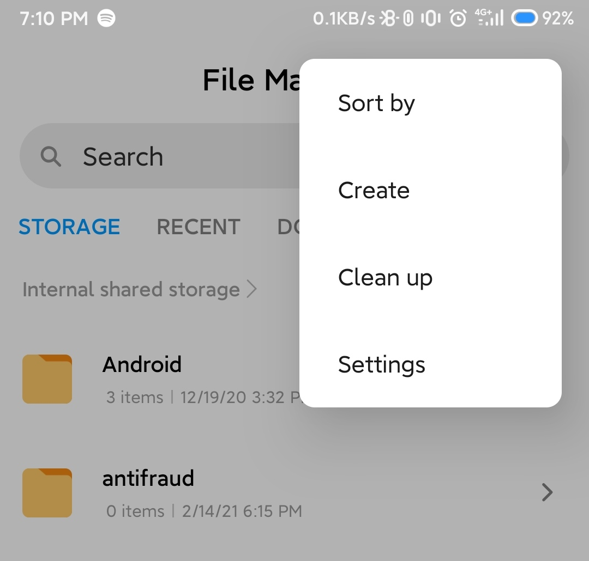

## Table of Content
1. [Sorting and searching are part of our life](#Sorting-and-searching-are-part-of-our-life)
1. [Sorting and Searching algorithm](#Sorting-and-Searching-algorithm)
1. [Sorting algorithm: Insertion and selection sort](#Sorting-algorithm-Insertion-and-selection-sort)
1. [Searching algorithm: Liniear and binary search](#Searching-algorithm-Liniear-and-binary-search)
1. [The tips and tricks](#The-tips-and-tricks)
1. [The Big O notation at glance](#The-Big-O-notation-at-glance)
1. [References](#references)

## Sorting and searching are part of our life
Mungkin bagian ini saya tidak akan banyak menulis tapi saya lebih memperlihatkan dimana saja kita materi ini akan digunakan.

Fitur search pada salah satu aplikasi e-commerce.


Fitur sort pada salah satu aplikasi e-commerce.


Fitur sort dan search pada aplikasi file manager di smartphone.


Dari contoh di atas kita sadari bahwa sorting dan searching sangat membantu kita dalam mencari data yang sesuai dengan keinginan kita, mengurutkan data sesuai dengan yang kita mau seperti contoh di atas kita lebih mudah menemukan harga termurah dari sebuah barang atau kita bisa juga melakukan sorting untuk barang dengan rating tertinggi.

Meski implementasi di atas tidak secara praktikal menggunakan algoritma pada materi yang akan kita pelajari, tapi materi yang kita akan pelajari kali ini adalah salah satu dasar dari implementasi yang lebih advance dan materi ini juga melatih kita untuk memiliki cara berfikir komputasi yang lebih baik.

## Sorting and Searching algorithm
Bagi manusia mungkin sangat mudah untuk melakukan pengurutan suatu data, terlebih jika data tersebut memiki kuantitas yang kecil atau datanya sedikit. Tapi bagaimana jika kita harus berhadapan dengan data dengan jumlah yang banyak, ratusan? Ribuan? Atau bahkan jutaan data, membayangkannya saja sudah membuat kesal. Nah, disinilah kita membutuhkan mesin untuk melakukan komputasi pada data dengan kasus seperti di atas. 
Tapi yang menjadi masalah adalah mesin tidak dapat berfikir seperti manusia, mesin hanyalah mesin. Kita harus memberikan cara yang spesifik agar mesin mengerti bagaimana melakukannya dan membuat spesifikasi atau langkah kerja untuk melakukan pencarian atau pengurutan inilah yang disebut algoritma searching and sorting. Okey no more talking, I'll tell you the point.

## Sorting algorithm: Insertion and selection sort

Mari kita mulai dari ***insertion sort***. Saya akan memebrikan ilustrasi bagaimana isertion sort dilakukan.


Kita bisa lihat di atas terdapat data yang memiliki urutan acak. Ide dari insertion sort adalah mengabil data dari yang paling ujung untuk dibandingkan dengan data sebelah kiri dari data yang diambil, jika data sebelahnya lebih besar maka data tersebut akan di geser ke kanan hingga data di sebelah kiri sudah tidak ada lagi yang lebih besar dibanding data yang sedang diambil/dipilih. Jika sudah tidak ada lagi yang lebih besar di sebelah kiri maka data yang dibandingkan akan disisipkan di sana.

Berdasarkan visualisasi di atas kita dapat menuliskan peseudocode dari algoritma insertion sort seperti berikut;
```javascript
for i = 1 to n-1
	for j = 0 to i-1
        if A[i] < A[j] 
            swap A[i] and A[j]
	    end if
    end for
end for
```
* ***NOTE*** => Proses menggeser data secara abstrak(visual) memang terlihat mudah, tapi kembali lagi bahwa mesin tidak dapat berfikir seperti manusia. Pada tiap penggeseran data terdapat operasi pertukaran posisi hanya saja pada visual di atas tidak digambarkan sebagai data yang disisipkan(data seperti tidak menempati posisi manapun).


Selanjutanya kita akan membahas mengenai algoritma ***selection sort***. Jika dibandingkan dengan insertion sort jenis sorting ini sedikit berbeda karena kita bisa mengklasifikasikan 2 kumpulan data yaitu sorted dan unsorted, untuk selengkapnya kita bisa lihat pada visualiasi di bawah.


Terdapat 4 warna yang mendeskripsikan kondisi dari ketika selection sort dijalankan.

1. Pertama, warna kuning menggambarkan kumpulan data sudah dalam kondisi terurut.
2. Kedua, warna putih menggambarkan kumpulan data yang belum terurut.
3. Ketiga, warna merah adalah data yang saat ini dievaluasi sebagai data terkecil dari kumpulan data yang tidak terurut (putih).
4. Keempat, warna biru merepresentasikan data yang sedang dicari untuk dibandingkan dengan data merah (current min), jika pada saat proses pengecekan data berwarna biru lebih kecil nilainya dari data merah maka data biru tersebut berubah menjadi merah(current min/ditandai sebagai yang terkecil).

* ***NOTE*** => Pada algoritma ini yang harus diingat adalah pada saat pengecakan current minimum(merah) kita tidak perlu mengubah posisi data hanya memberikan flag atau tanda bahwa data tersebut adalah data minimum.

Untuk tahapannya pertama adalah memberikan flag pada element index 0 (starting point unsorted) sebagai value yang akan ditukar jika menemukan value yang lebih rendah, kedua set element setelahnya sebagai current minimum, ketiga kita lakukan iterasi sampai batas akhir dari panjang array dan melakukan evaluasi perbandingan terhadap nilai minimum yang sudah di set pada tahap kedua, keempat jika saat iterasi ditemukan element array yang nilainya lebih kecil dari current minimum maka element itu diberikan flag current minimum(replace current minimum sebelumnya) tanpa mengubah posisi array, kelima jika hingga batas terakhir telah dicapai maka current minimum value akan ditukar posisi array dengan element yang telah di berikan flag pada tahap pertama, keenam mengulangi tahapan dari awal hanya saja elemen yang diberi flag starting unsorted maju ke depan jika pada visualisasi elemen starting pointnya dimulai oleh value 8 maka selanjutnya dimulai dari index ke 1 atau element dengan nilai 5.

Contoh ilustrasi dan pseudocode selection sort algorithm.


## Searching algorithm: Liniear and binary search

Pertama saya akan membahas dari yang mudah terlebih dahulu yaitu ***liniear search.*** Linear search bisa dibilang salah satu searching algorithm yang paling mudah untuk diimplementasikan.

Berikut ini adalah bentuk visualiasasi dari linear search algorithm.


Linear search algorithm biasa disebut juga sequence search karena sifat dari operasinya yang mengurut dari index paling bawah ke paling atas. Karena sangat sederhana algoritam jenis ini dapat digunakan hanya dengan sebuah loop untuk mencari data dari sebuah array, di bawah ini adalah bentuk pseudocodenya.


Inti dari algoritma ini adalah pada iterasi dan mengevaluasi value element dengan nilai yang dicari.

Selanjutnya kita akan bahas mengenai ***binary search*** atau biasa disebut binary search tree. Sebelumnya kita sudah bahas mengenai struktur tree pada kumpulan data. Karena namanya, bentuk tree ini dapat kita implementasikan menggunakan cara recursive begitu pula dengan menggunakan loop. Di bawah ini adalah gambaran bagaimana binary search tree terbentuk.


Dan ini adalah bentuk bagaimana binary search bekerja.


kita bisa lihat dari strukturnya jika jenis algoritam pencarian ini beroperasi dengan cara membagi 2 bagian yaitu left node dan right node yang mana pada posisi tengah tiap node dinamakan root. Binary search akan membandingkan nilai yang dicari dengan root paling atas jika hasil perbandingan nilai yang dicari lebih besar dari root value maka operasi akan terus berlanjut dengan melakukan evaluasi pada node sebelah kanan(right node) jika lebih kecil maka dievaluasi pada node sebelah kiri(left node). Operasi pencarian akan berakhir jika nilai root(middle value) sama dengan nilai yang dicari.

Berikut ini adalah gambaran lain dari binary search tree serta pseudocodenya.


```javascript
binarySearch(arr, target, mid)
	get mid index if mid is null
	if arr(mid) equal to target, return mid
	else
		Get new mid index
        (0-mid || mid-arr.length-1)
		binarySearch (using new mid)
```
## The tips and tricks

Seteleh kita bahas secara singkat materi sorting dan searching kita bisa memtakan beberapa operasi yang sering digunakan pada algoritma ini yang diantaranya adalah:

1. ***Loop*** => hampir dari semua algritma yang kita bahas sebelumnya, banyak yang menggunakan loop untuk melakukan iterasi. Jika dilihat pada selection insertion sort loop sangat berpengaruh untuk menjalankan operasinya terlebih pada kedua operasinya kita bisa lihat bahwa keduanya menggunakan nested loop untuk menjalankan operasinya. Menariknya, nested loop ini bukanlah nested loop biasa, jika kita lihat kembali insertion sort, disana menggunakan nested loop hanya saja batas akhirnya adalah variable yang berubah-ubah dan dipengaruhi oleh variable yang ada pada outer loopnya. Inilah yang harus kita perhatikan bahwa dengan mendefinisikan loop kita tidak kaku untuk batas akhirnya tapi kita juga dapa manipulasi untuk kepentingan algoritma.
2. ***Swap*** => operasi ini adalah hal yang essensial karena untuk melakukan pemindahan nilai dari suatu index dibutuhkan teknik swapping agar nilai yang akan dipindah tidak tertukar atau pemindahannya tepat, Saya akan memberikan beberapa cara swap nilai pada javascript. 

Menggunakan metode destructuring.
```javascript
let a
let b
[a, b] = [1, 4]
console.log(`ini a: ${a} dan ini b ${b}`);
[a, b] = [b, a]
console.log(`ini a: ${a} dan ini b ${b} setelah swap`);
```

Menggunakan metode temporary variable.
```javascript
let c = 1;
let d = 2;
let temp;
console.log(`ini c: ${c} dan ini d ${d} temp`);

temp = c;
c = d;
d = temp;
console.log(`ini c: ${c} dan ini d ${d} temp setelah swap`);
```

3. ***Flagging*** => Ini adalah salah satu cara yang saya pakai jika membentuk algoritma yang lumayan kompleks, cara ini sebenarnya diimplementasikan juga pada selection sort. Kita bisa lihat pada selection sort terdapat instruksi set minimum sebagai penanda element paling kecil diantara unsorted list yang ada. Teknik ini saya biasa menyebutnya flagging karenya memberikan tanda pada element yang mana element yang diberi tanda akan dioperasikan pada kondisi tertentu dan element akan lebih mudah dipanggil/dioperasikan jika kita merujuk pada flag yang telah dibuat.

4. ***Be more specific*** => Terkadang visualiasi tidak menggambarkan secara praktik kode bekerja, karenanya kita harus pahami betul setiap langkah yang digambarkan oleh visualisasi akan menjadi operasi seperti apa jika kita hands on ngoding langsung, contohnya adalah proses penggeseran pada insertion sort, proses geser nilai dapat direpresentasi dengan operasi swap value.

5. ***Think twice code once*** => Meski tidak serta merta ketika kita berfikir 2 kali lalu langsung bisa, tapi konsep ini mengajarkan agar kita memahami betul apa yang mau kita tulis. Programmer yang baik adalah programmer yang tau output dari apa yang ditulisnya. Juga dengan konsep ini kita dapat menghindari tangled code karena terlalu banyak mencoba tanpa berfikir dahulu.

## The Big O notation at glance
Big O notation singkatnya adalah metode untuk menggambarkan tingkat kecepatan sebuah algoritma jika dioperasikan pada data. Tiap algoritma memiliki sifat dan cara kerjanya masing-masing karenanya hal tersebut juga dapat memengaruhi kecepatan untuk menyelesaikan masalah. Pengukuran kecepatan ditinjau dari seberapa banyak operasi yang dilakukan untuk dapat menyelesaikan masalah sebagai contoh binary search dan liniear search memiliki cara kerja yang sangat berbeda. Kita dapat melihat perbandingan kedua algoritma tersebut seperti di bawah ini.


Pada visualiasi di atas dibandingkan cara kerja dan jumlah langkah yang ditempuh untuk menemukan sebuah nilai pada array yang diberikan. Sangat jelas terlihat dengan menggunakan binary search ini kita dapat menghemat banyak waktu untuk menyelesaikan masalah. Mungkin kita lihat perbandigan jumlah langkah pada kedua algoritma di atas hanya sedikit dan tidak berpengaruh secara signifikan. Akan tetapi jika kita komparasikan kedua algoritma tersebut dengan data yang lebih banyak jumlahnya maka akan terlihat jelas perbedaan keduannya. Untuk lebih jelasnya kita dapat melihat tabel perbandingan binary search dan liniear search di bawah ini.


Pada baris kedua terdapat runtime jika dinotasikan oleh big O notation. Sebenarnya notasinya ini memiliki banyak jenis tidak hanya liniear dan logaritmik saja. Kita bisa melihat bagaimana big o notation dinotasikan berdasarkan faktor pengaruh jumlah element dan jumlah operasinya.


Akan tetapi kita tidak bisa hanya mengukur bagus atau buruknya algoritma hanya dari tingkat kecepatannya saja, karena tiap algoritma memiliki kompleksitas dan tingkat kesulitannya masing-masing. Terlebih ada beberapa algoritma yang memiliki persyaratan khusus seperti binary search hanya bisa diimplementasikan jika data terurut, ini menjadi masalah baru karena jika data sangat acak kita butuh algortima sorting sebagai tambahan operasi lalu mengimplementasikan binary search itulah mengapa kita tidak bisa serta merta mengacu hanya dari tingkat kecepatannya saja untuk menilai baik atau buruk sebuah algoritma.

## References

https://www.bigocheatsheet.com/

https://www.freecodecamp.org/news/big-o-notation-why-it-matters-and-why-it-doesnt-1674cfa8a23c/

https://www.freecodecamp.org/news/big-o-notation-explained-with-examples/

https://dmitripavlutin.com/swap-variables-javascript/

https://visualgo.net/